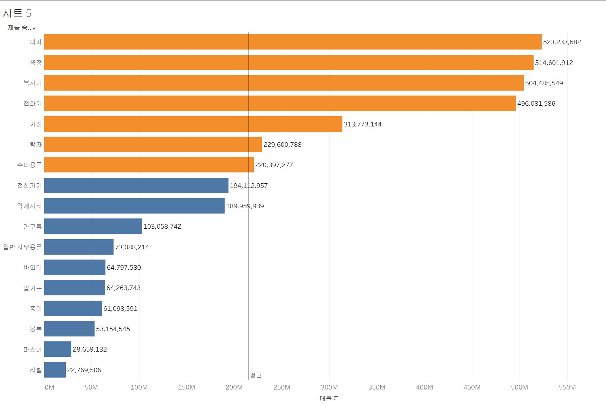
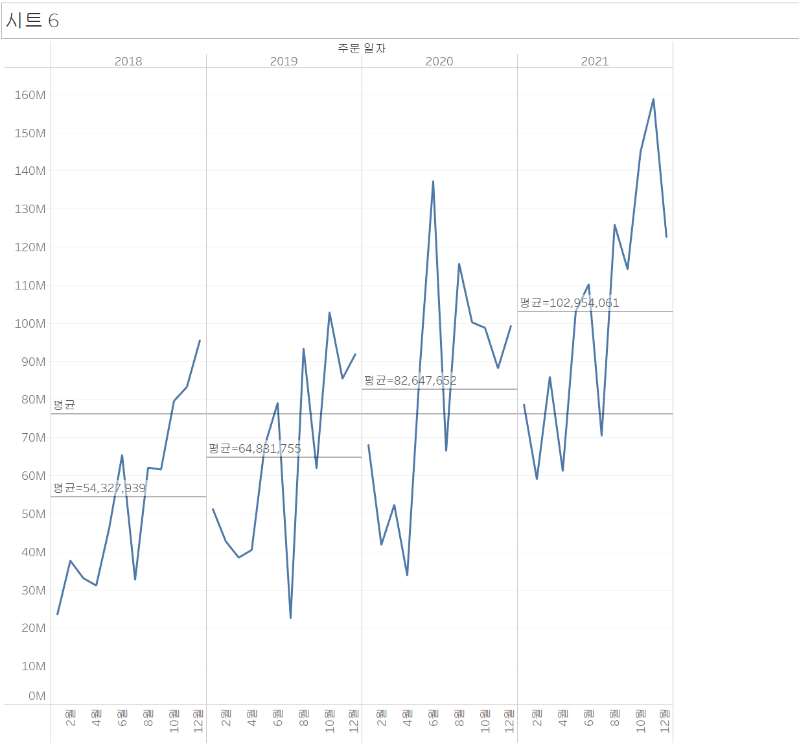

# Chp.1 태블로 이해하기

**Digital Transformation**
- 데이터를 비지니스에 적극 활용할 수 있도록 하는 것
- 기업의 당면 과제 

**Data Literacy**
- 데이터를 보고 활용할 수 있는 능력
- 기업의 구성원들에게 요구되는 능력
- 데이터는 보는 것이 아니라 이해하고 대화와 협업을 통해 찾은 통찰을 공유하는 것

**Data Visualization**
- 데이터에 사람들의 시선을 끌 수 있는 요소를 배치하여 데잍를 시각적으로 표현하는 것 

**태블로(Tableau)란**
- 데이터를 분석 및 시각화하는 Business Intelligence(BI)

**EP3. 태블로 기본 컨셉 이해하기**
**측정값 vs 차원**
- 측정값: 숫자 형식, 액션(drag-drop or double-click)을 통해 설정된 집계에 따라 차트를 만들게 됨
- 차원: 그 숫자들로 만들어진 차트를 어떻게 나눠서 볼 것인지 결정 

워크시트-테이블의 변수 드래그/더블클릭

**불연속형 vs 연속형**
- 불연속형: 파란색 / 연속형: 초록색

