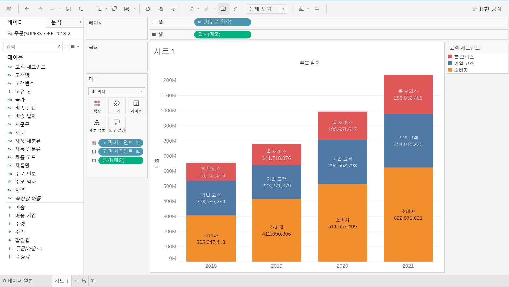
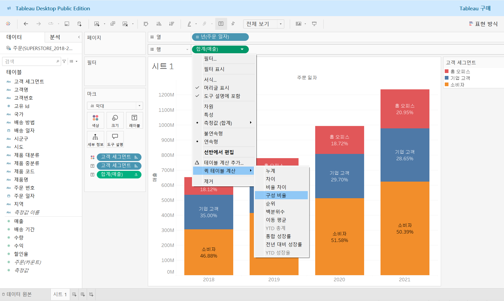
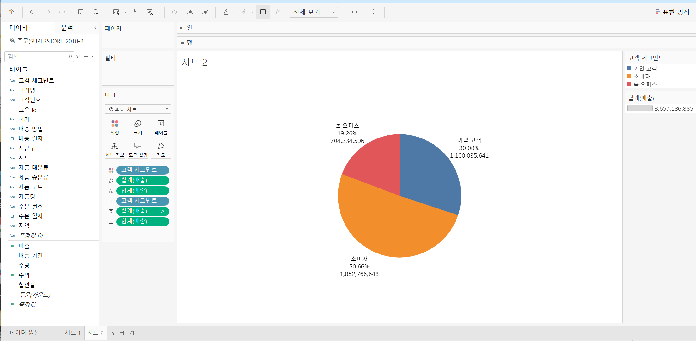

# Chp.2 태블로 기초 이해

**태블로 부분 전체 분석**

1. 막대 차트

- 열, 행, 레이블 등 각각 세부 옵션 조절 가능
- 계산대상 - 테이블 아래로: 각 막대차트를 100% 비율로 볼 수 있음

2. 파이 차트

- 레이블 편집을 통해 텍스트 편집 가능

3. 도넛차트
- 열 칸에 임의로 0 입력하여 차트 생성
- 마크 칸에서 파이차트로 변경
- ctrl을 누른 상태로 열 칸의 합계를 드래그 해 복사 

- 파이차트&도넛차트는 인접한 값의 차이가 크게 없을 때 트리 맵이 더 나음 

**태블로 상관 관계 분석**
- 분산형 차트: 측정값이 2~4개이면 추천

4. 분산형 차트
- 측정값 간의 관계를 파악하기 위한 시각화 방식
- 열 선반과 행 선반에 올리는 필드는 고정적으로 배치가 가능하지만, 별도의 매개 변수를 만들면 매개 변수 값에 따라 분산형 차트를 활용 가능

**태블로 기초 이해**

이중축 vs 결합된 축

1. 이중축(Dual Axis)
- ctrl+드래그로 행 측정값 두 개 만들기
- 세모 - 이중축

2. 결합된 축
- 하나의 뷰에서 같은 축을 결합 또는 공유
- 마크가 동일하게 구성성