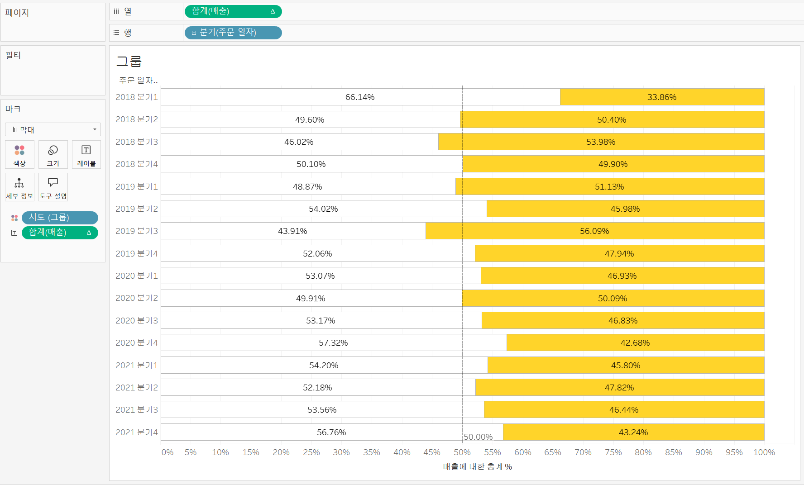
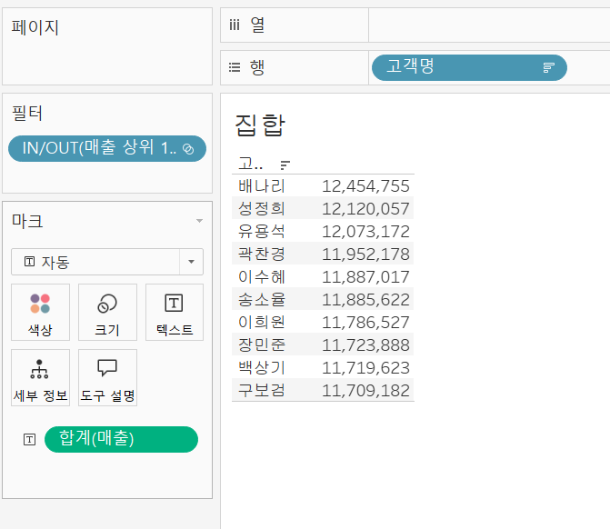
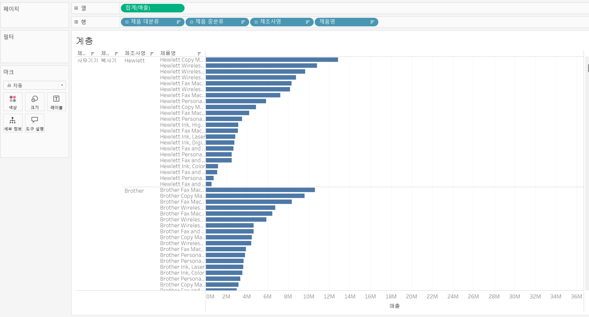
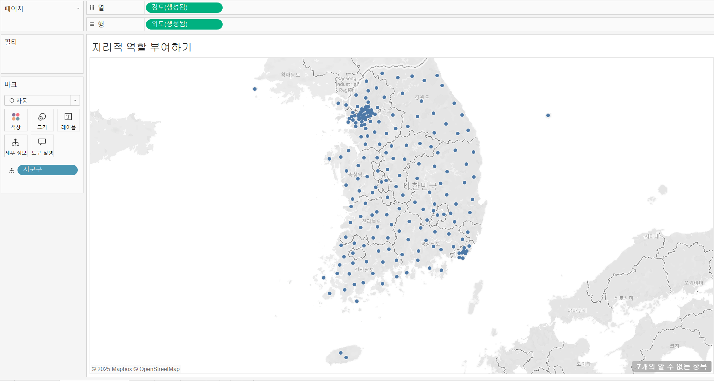
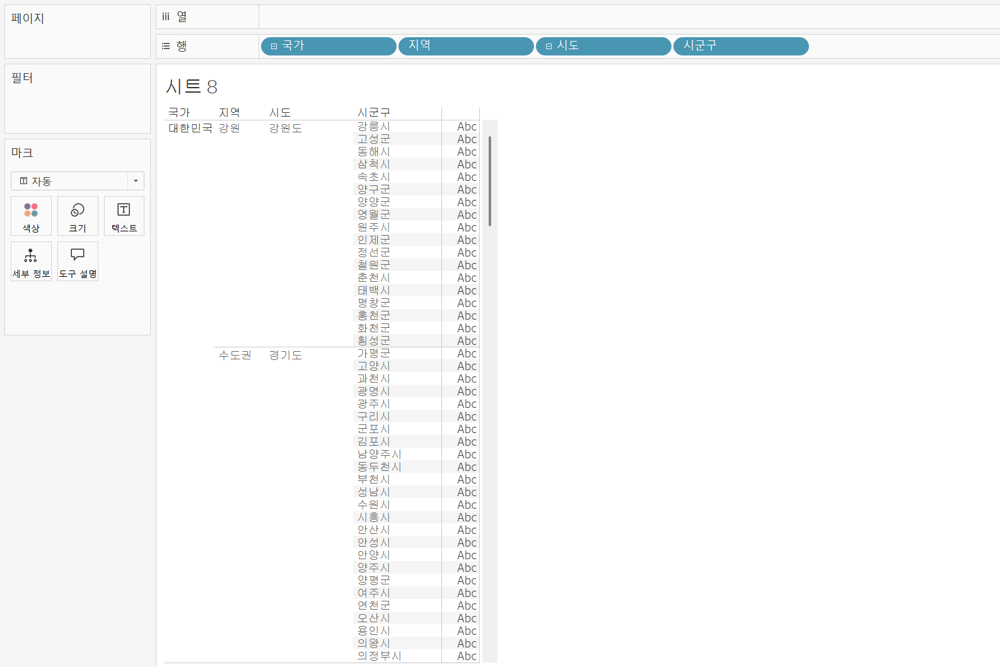
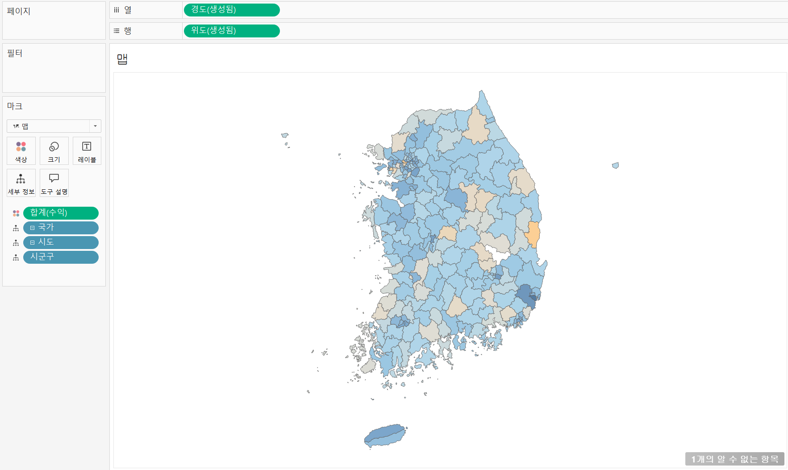

# EP.8 태블로 그룹 VS 집합
- 그룹: 항목 내 멤버들을 묶는 것
- 집합: 집합에 포함되는 지 or 아닌 지 

1. 그룹 
- 테이블 -> 만들기 -> 그룹 

2. 집합
- 테이블 -> 만들기 -> 집합
- in/out으로 나옴

- in으로 필터링한 결과 값

# EP. 9 테이블 구성하기 - 계층과 총계
- 계층: 값을 세부적으로 찾는데 유용
- 총계: 각각의 요소의 total, 열과 행 기준으로 보여줄 수 있음

1. 계층

# EP. 10 맵 만들기
- 시도와 시군구만 있어도 맵 구현 가능
- 맵에서는 계층을 만들지 않으면 일부 데이터 누락 가능성 있음 

1. 지리적 역할 부여하기

- 테이블 세모-지리적역할

2. 맵

- 계층을 생성하지 않으면 누락되기 때문에 계층 생성
ex) 중구, 서구와 같은 구는 여러 도,시에 존재

- 맵 > 백그라운드 레이어에서 배경 맴 편집 가능 

# QUIZ
1. 파이 차트 두 개로 도넛 차트를 만들 때 활용하는 기능
-> 이중축
2. 결합된 축 마크는 반드시 동일하게 구성되어야 함
3. 지리적 역할로 변경할 경우 '시군구'는 카운티로 변환