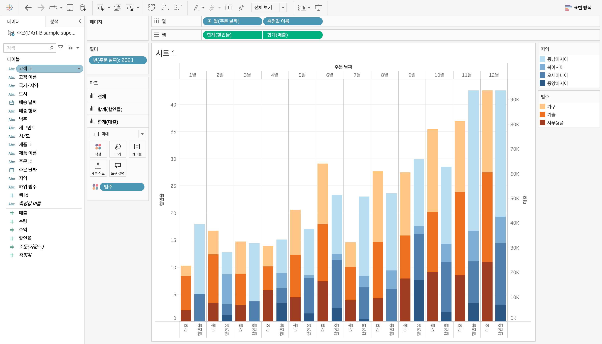

# Tableau 1주차 정규과제

📌Tableau 정규과제는 매주 정해진 **유튜브 강의를 통해 태블로 이론 및 기능을 학습한 후, 실습 문제를 풀어보며 이해도를 높이는 학습 방식**입니다. 

이번주는 아래의 **Tableau_1st_TIL**에 명시된 유튜브 강의를 먼저 수강해주세요. 학습 중에는 주요 개념을 스스로 정리하고, 이해가 어려운 부분은 강의 자료나 추가 자료를 참고해 보완하세요. 과제 작성이 끝난 이후에는 **Github에 TIL과 실습 인증 결과를 업로드 후, 과제 시트에 제출해주세요.**


**(수행 인증샷은 필수입니다.)** 

> 태블로를 활용하는 과제인 경우, 따로 캡쳐도구를 사용하여 이미지를 첨가해주세요.


## Tableau_1st_TIL

### 10. 차원과 측정값

### 11. 시각화

### 12. 막대 그래프

### 13. 누적막대 그래프

### 14. 병렬막대 그래프

### 15. 누적병렬막대 그래프

### 16. 라인 그래프

### 17. 맵 작성

### 18. 텍스트 레이블

### 19. 트리맵과 하이라이트 테이블


<br>

## 주차별 학습 (Study Schedule)

| 주차  | 공부 범위          | 완료 여부 |
| ----- | ------------------ | --------- |
| 0주차 | **강의 1 ~ 9강**   | ✅         |
| 1주차 | **강의 10 ~ 19강** | ✅         |
| 2주차 | **강의 20 ~ 29강** | 🍽️         |
| 3주차 | **강의 30 ~ 39강** | 🍽️         |
| 4주차 | **강의 40 ~ 49강** | 🍽️         |
| 5주차 | **강의 50 ~ 59강** | 🍽️         |
| 6주차 | **강의 60 ~ 69강** | 🍽️         |

<!-- 여기까진 그대로 둬 주세요-->

시작 17:20

---

# 학습 내용 정리

## 10강: 차원과 측정값

<!-- 차원과 측정값에 관해 배우게 된 점을 적어주세요 -->

> **🧞‍♀️ 차원과 측정값의 고유한 특성에 대해 설명해주세요.**

```
- 차원: 정성적이고 불연속적인 데이터
- 측정값: 차원의 세부 항목
- 차원&측정값, 연속&불연속은 별개의 개념이므로 혼합해서 생각하면 안 됨
```

*Quiz: 차원은 불연속형이고, 측정값은 연속형이다 (o, x)*
*- 아니다. 대체적으로 그런 경우가 많지만 서로 변환이 가능하다.*


- 차원: 정성적인 값, 불연속, 집계되거나 계산되지 않는 독립적인 필드 ex. 이름
- 필드: 정량적인 수치값, 연속, 집계될 수 있음 ex. 매출


## 11강: 시각화

<!-- 시각화 관해 배우게 된 점을 적어주세요 -->

*Quiz: 차원은 대부분 불연속형이며 표 형태로 시각화했을 때 머리글로 표시되고, 측정값은 대부분 연속형이므로 표 형태로 시각화 진행했을 때 패널로 추가된다.(o, x)*
*(O)*


## 12강: 막대그래프

<!-- 막대그래프에 관해 배우게 된 점을 적어주세요 -->

- 행과 열 바꾸기 선택 -> 가로 막대그래프로 변경 가능

- 마크-색상을 이용해서 막대그래프의 색상 변경 가능


## 13강: 누적막대그래프

<!-- 누적막대그래프에 관해 배우게 된 점을 적어주세요 -->

<!-- 테이블(아래로)와 테이블(옆으로)의 계산 방식을 습득해보세요. 이에 관련해 아래 참고자료도 있습니다 :) -->

- command+드래그 -> 복사 가능
- 테이블 옆으로: 전체에서 누적 비율 / 테이블 아래로: 카테고리별 누적 비율


## 14강: 병렬막대그래프

<!-- 병렬막대그래프에 관해 배우게 된 점을 적어주세요 -->

- 위의 유형: 불연속형 / 아래 유형: 연속형
- 연속형은 초록색, 불연속형은 파란색으로 구분

<br>


> *🧞‍♀️ 끊어진 색상으로 배치되어 표현되는 경우와 이어지는 그라데이션 색으로 표현되는 경우 두 가지가 있습니다. 위 사진의 경우 왜 색깔이 끊어지는 색상으로 표시되지 않고 그라데이션으로 표시되었나요? 데이터의 특성과 관련하여 이야기해 봅시다.*

```
- 연속형일 경우 색상이 그라데이션으로 표현된다
```


## 15강: 누적병렬막대그래프

<!-- 누적병렬막대그래프에 관해 배우게 된 점을 적어주세요 -->

- 막대 두께는 마크-크기 탭에서 변경가능


- 필드별 색상은 마크-색상-색상편집에서 변경 가능


> *🧞‍♀️ 위 사진에서는 Profit과 Sales를 측정값으로 두었습니다.  개별 칼럼(태블로에서는 #필드라 명칭합니다)을 열/행에 두는 대신, '측정값'을 사용하고 측정값 선반에 필드를 올려둡니다. 이런 방식을 사용하는 이유가 무엇일지, 어떻게 사용할 수 있을지 고민해보세요*

```
- 측정값을 사용하면 여러 필드를 하나의 그래프에서 비교할 수 있다.
```

<!-- 정답은 없습니다 -->


## 16강: 라인그래프
**라인차트**
- 데이터의 시간별 추세를 확인하거나 미래 값을 예측하려고 할 때 주로 사용
<!-- 라인그래프에 관해 배우게 된 점을 적어주세요 -->

- 열의 불연속 연도-월에서 연도를 없애고 연속 월로 바꾸면 연속된 차트 생성 가능 


- 이중축을 이용한 이중 라인차트
- 축-축동기화를 통해 맞출 수 있음

## 17강: 맵작성

<!-- 맵차트 관해 배우게 된 점을 적어주세요 -->

- 위도1(매출), 위도2(수익)+원그래프 -> 이중축 이용


```js
## 참고
Country/Region - 나라/지역
State/Province - 시/도
City - 시
County - 군
Postal Code - 우편번호
Area Code - 지역 코드
Airport - 공항
MSA/CBSA (Metropolitan Statistical Area) - 광역 통계 지역
Longitude - 경도
Latitude - 위도
```


## 18강: 텍스트테이블

<!-- 텍스트테이블에 관해 배우게 된 점을 적어주세요-->


## 19강: 트리맵과 하이라이트테이블

> *🧞‍♀️하이라이트 테이블 등에서 두개 이상의 측정값을 사용하는 경우, 함께 색을 표현하게 되면 단위가 달라 정확한 값을 표현할 수 없습니다. 이때 클릭해야 하는 항목은?*

```
- 마크-색상의 측정값-별도의 범례 사용
```


<br>

# 확인문제

## 문제1

```js
지민이는 superstore의 한국 수출 관리 업무를 맡고 있습니다. 국가/지역이 우리나라, 즉 'South Korea'인 데이터만을 필터링하여, 상품 하위범주 별로 각 하위범주가 매출의 비율 중 얼마만큼을 차지하는지를 트리맵으로 확인하고 싶습니다. 트리맵의 각 네모 안에 표시되는 텍스트에는 **해당 범주의 이름과 전체에서 해당 범주가 차지하는 비율**이 표시되었으면 합니다.

지민이를 도와주세요! (풀이를 찾아가는 과정을 기술해주세요)
```

```
- 지역 필드를 선택하여 South Korea만 선택, 트리맵 선택 후 상품 하위범주 필드를 라벨과 색상 마크에 드래그
```


## 문제2

```js
주현이는 국가/지역별로 매출과 수익의 증감을 시간에 흐름에 따라 표현하고자 합니다. 특히 **한국/중국/일본**을 비교하고자 해당 3국을 남기고 필터링했고, 3개 국가를 매출과 수익이라는 두 가지 지표로 확인해보았습니다.

아래는 위 설명을 표현해본 예시입니다.
```


```js
레퍼런스와 꼭 같지 않아도 자유롭게 표현하고, 그 과정을 기술해주세요.
```

```
여기에 답을 적어주세요!
```


### 참고 자료

```js
테이블 계산에서 '다음을 사용하여 계산'에는 테이블 당 계산과 패널 당 계산이 있습니다. 이에 대해 이해하는 것이 꼭 필요하기 때문에, 외부 레퍼런스를 참고하여 이 단계에서 꼭! 학습 후, 넘어가주세요 :)
```


[참고 외부자료 링크는여기를클릭하십시다](https://velog.io/@eunsuh/Tableau-%EB%A0%88%EB%B2%A8UP-%EA%B0%95%EC%9D%98-%EC%A0%95%EB%A6%AC-1-%ED%85%8C%EC%9D%B4%EB%B8%94-%EA%B3%84%EC%82%B0)

<br>

<br>

### 🎉 수고하셨습니다.